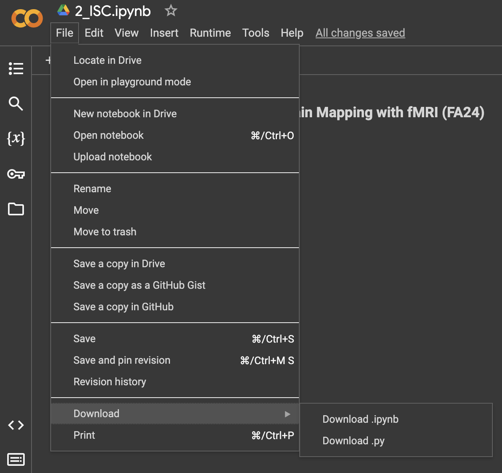

# PSYC60 Lab Exercise
## Principles of Human Brain Mapping with fMRI (FA24)
Eunhye Choe 

Open each notebook in this page by clicking the  button on the top.
Once the notebook is open in Colab, save a copy to your Google Drive or Download in your local computer.
  
To submit your assignment, download the notebook in the `.ipynb` format using the download tab.

  
```{tableofcontents}
```
